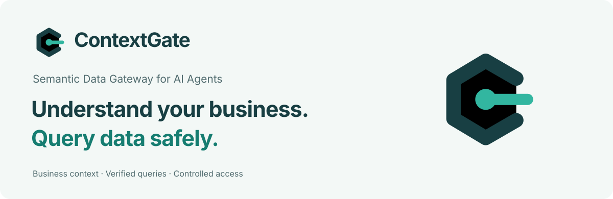
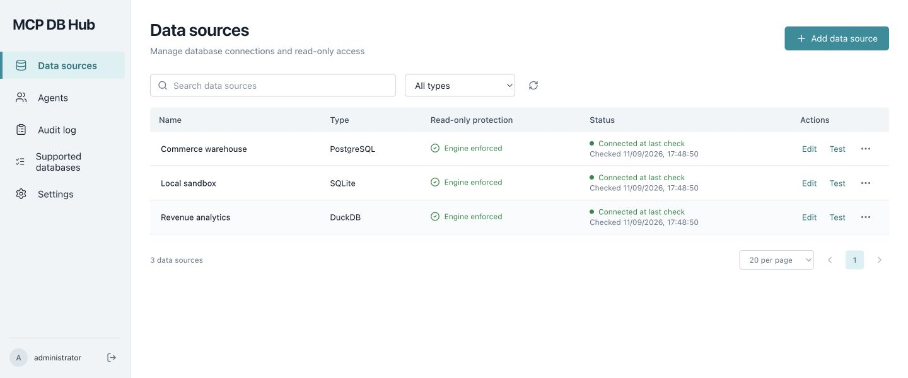
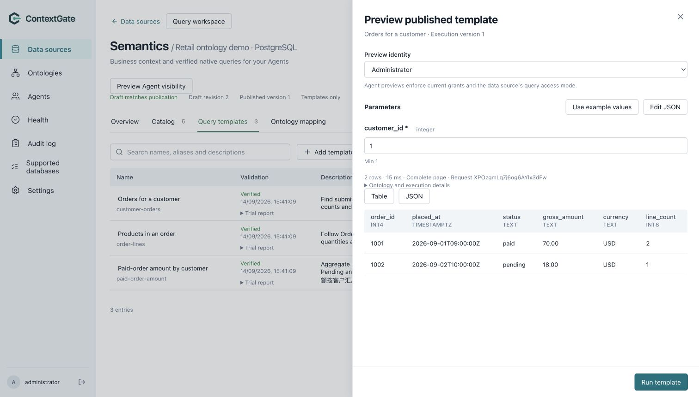
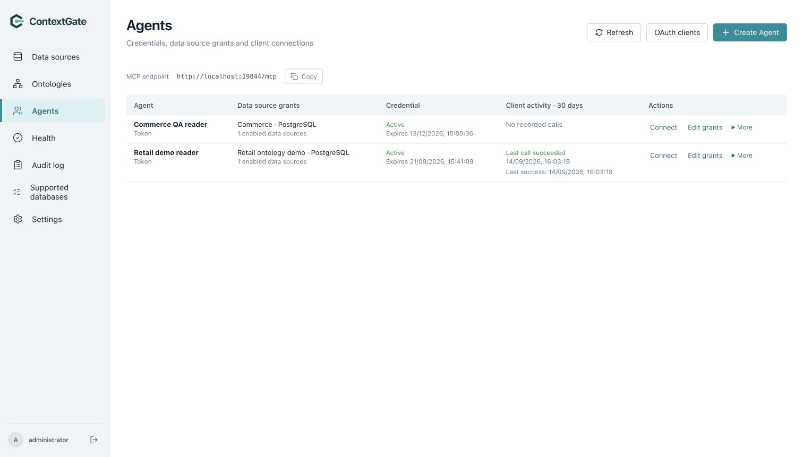

# MCP DB Hub



[](https://github.com/SamuelSupe/mcpdbhub/releases/latest)
[](https://github.com/SamuelSupe/mcpdbhub/actions/workflows/ci.yml)
[](go.mod)
[](docs/support-matrix.zh-CN.md)

**让 Agent 通过原生查询读取数据库，并明确控制每个 Agent 可以访问的数据源。**

用 Go 实现的自部署只读 MCP 服务。管理员通过内嵌 Web UI 配置连接和授权；Agent 使用数据库原生语言查询，所有入口共享只读保护、执行限制与审计。运行时无需 Node.js。

[English](README.md) · [下载 v0.1.1](https://github.com/SamuelSupe/mcpdbhub/releases/tag/v0.1.1) · [安装指南](docs/install.zh-CN.md) · [支持矩阵](docs/support-matrix.zh-CN.md) · [只读账号](docs/read-only-accounts.zh-CN.md) · [架构](docs/architecture.zh-CN.md)



*真实运行的英文管理界面；截图使用隔离数据库与示例数据。*

## 能做什么

| 能力 | 提供的行为 |
|---|---|
| 原生读取 | SQL、MongoDB、Redis、Search DSL、Cypher、CQL、InfluxQL / Flux |
| Agent 独立授权 | 数据源级授权、精确到期、暂停、轮换、永久撤销与 OAuth |
| 实际只读保护 | 解析器和引擎分类、只读事务/文件、命令白名单与固定读取 API |
| 有界查询 | 超时、取消、并发隔离、结果大小限制、身份绑定的分页游标 |
| 无损结果 | 保留大整数、Decimal、二进制和原生文档/图/时序结构 |
| 一体化管理 | 内嵌 UI、加密凭证、结构预览、调用审计与本地密码恢复 |

## 下载运行

首版提供 Linux **arm64 / amd64** 发行包，包含程序、C++ 运行库、双语说明、依赖许可证与 `SHA256SUMS`，要求 glibc ≥ 2.36。解压后执行 `./mcpdbhub serve` 即可启动。完整下载、校验、Agent 接入和升级步骤见[安装指南](docs/install.zh-CN.md)。

## 启动

```sh
mkdir -p databases
docker compose up --build -d
docker compose logs hub
```

打开 `http://127.0.0.1:8080`，使用日志中的一次性设置码创建管理员密码。随后依次添加数据源、测试连接、创建 Agent 并选择允许访问的数据源。Token 仅显示一次。

默认仅发布本机端口；容器内使用 UID 10001。数据库文件挂载目录只读，数据库文件本身需要对 UID 10001 可读。`hub-data` 保存配置与审计；不要在升级时删除该卷。

本地编译需要 Go 1.26、C/C++ 工具链、Node.js 24（仅用于构建前端）。DuckDB 和 SQLite 使用 CGO，不能以 `CGO_ENABLED=0` 构建。Linux arm64/amd64 使用各自平台原生编译。

```sh
make build
./bin/mcpdbhub serve --data-dir ./data --database-dir ./databases
```

公司代理需要自定义 CA 时，可使用 `docker build --secret id=build_ca,src=/path/to/ca.pem -t mcpdbhub:local .`。该 CA 只用于构建依赖下载，不会写入最终镜像。数据库 CA 单独在 UI 中配置。

## Agent 接入



支持 Streamable HTTP 和 stdio 桥接；二者使用同一个 HTTP 服务、同一套授权和审计。服务暴露 11 个 MCP 工具：4 个发现工具和 7 个原生查询工具。

HTTP 客户端配置示例（不同客户端的外层配置格式可能不同）：

```json
{"mcpServers":{"mcpdbhub":{"url":"http://127.0.0.1:8080/mcp","headers":{"Authorization":"Bearer <AGENT_TOKEN>"}}}}
```

stdio 客户端配置：

```json
{"mcpServers":{"mcpdbhub":{"command":"/absolute/path/mcpdbhub","args":["stdio","--url","http://127.0.0.1:8080/mcp"],"env":{"MCPDBHUB_TOKEN":"<AGENT_TOKEN>"}}}}
```

先调用 `list_data_sources` 获取当前身份可访问的数据源、查询工具、示例与限制，再调用 `list_namespaces`、`list_objects`、`describe_object` 发现结构。

```json
{"name":"query_sql","arguments":{"source_id":"src_...","query":"WITH totals AS (SELECT region,sum(amount) AS total FROM orders WHERE created_at >= $1 GROUP BY region) SELECT region,total,rank() OVER (ORDER BY total DESC) FROM totals","params":["2026-09-01"],"max_rows":100,"timeout_seconds":10}}
```

查询工具分别为 `query_sql`、`query_mongodb`、`query_redis`、`query_search`、`query_cypher`、`query_cql`、`query_influxdb`。参数结构由 MCP 工具 schema 定义。Agent 不能传入连接地址、凭证或 HTTP 路径。

## 数据库与结果

适配 PostgreSQL、MySQL、MariaDB、TiDB、CockroachDB、TimescaleDB、SQLite、DuckDB、ClickHouse、MongoDB、Redis、Valkey、Elasticsearch、OpenSearch、Neo4j、Cassandra、ScyllaDB、InfluxDB。InfluxDB 按 1.x、2.x、3 Core 分别验证。**正式验证状态以支持矩阵中的实际版本和证据为准。**

SQL 支持原生关联、子查询、只读 CTE、聚合和窗口函数。MongoDB 支持 find、聚合、计数、distinct；Redis 支持常见数据结构的白名单读取；搜索保留 DSL 与聚合；Neo4j 保留节点、关系和路径；CQL 提供原生页状态。

返回值包含 `format`、`data`、可用的原生类型信息、`row_count`、`elapsed_ms`、`truncated`、`bytes`，原生分页可返回 `next_cursor`。MCP 同时返回结构化内容与 JSON 文本，兼容仅读取文本的客户端。64 位整数和 Decimal 使用字符串，二进制使用带 `encoding: base64` 的对象，时间保留可用精度。MongoDB 使用规范 Extended JSON；Flux 保留每张表的列名和类型。某些引擎/API 不提供计算列的精确类型，不能将缺失类型解释为字符串类型。

默认上限为 30 秒、1,000 条、5 MiB，管理员可提高至 120 秒、10,000 条、20 MiB。Agent 可通过 `max_rows`、`timeout_seconds`、`max_bytes` 收紧限制。字节预算包含 MCP 的两种结果表示，因此实际数据可小于配置上限。单行或原生响应过大时可能返回明确的大小错误；不会把不完整 JSON 当完整结果。

游标绑定 Agent、数据源版本、操作、完整查询与参数，5 分钟过期。续页必须使用相同参数和限制，仅替换 `cursor`。SQL/Cypher 查询分页由查询显式表达；MongoDB 使用原生游标，5 分钟过期、每数据源最多 64 个，续页一次消费。搜索 `search_after` 需要稳定排序，不提供跨页快照隔离。Redis SCAN 的 COUNT 是提示值，若单批超限会标记截断并不返回会跳过数据的游标。

SQL 数据源的命名空间、表和字段发现支持 `next_cursor`，管理界面可点击 **Next page**。每页遵守行数与响应大小限制，超过 1000 张表不会静默丢失。结构分页使用有序偏移，不提供跨页快照；数据库结构变化时应重新开始发现。

## 授权和只读保护

授权粒度固定为 Agent → 数据源。数据库账号、视图和数据库自身权限负责库、表、字段与行范围；可将同一个数据库配置成多个不同权限的数据源。

查询层结合解析器/引擎分类、只读事务或文件模式、函数/命令白名单及固定读取 API。禁止多语句、写入型 CTE、DDL/DML、锁定读取、导入导出、扩展和危险脚本。自定义函数不属于承诺支持范围；只读并不意味着任意合法原生查询都会被接受，拒绝项与原生能力限制见矩阵。

连接成功与账号权限验证分别展示。显示“账号权限未验证”时必须根据数据库端授权确认访问范围。InfluxDB 3 Core 显示“查询 API 隔离”：其管理员 Token 仍有数据库管理权限，服务通过固定查询 API 限制 Agent。

配置使用 SQLite；数据库凭证以 AES-256-GCM 加密，主密钥独立保存于 `master.key` 或 `MCPDBHUB_MASTER_KEY`（32 字节密钥的标准 Base64）。管理员密码使用 Argon2id，Agent Token 和会话 Token 使用散列。管理 Cookie 为 HttpOnly/SameSite，管理写接口验证 CSRF。审计保留 30 天，不保存查询结果、参数明文和完整查询文本。授权变化会取消相关执行任务。

## OTLP 审计上报

v0.1.1 支持在 **Settings → Audit log export** 配置 OTLP Logs，通过 HTTP/protobuf 或 gRPC 上报到 OpenTelemetry Collector 或兼容接收端。支持认证 Header 加密、CA 证书、测试发送和状态查看；异步读取已有脱敏审计，持久化进度并重试，不发送完整查询、参数、结果或凭证。详见[配置、Collector 示例和发送语义](docs/audit-export.zh-CN.md)。

## OAuth

内置 Ory Fosite，支持授权码、PKCE S256、显式管理员同意、刷新令牌轮换和撤销。访问令牌 15 分钟，刷新授权 30 天。OAuth 与独立 Token 共用 Agent 的数据源授权记录，每次同意创建独立授权。

发现端点：`/.well-known/oauth-protected-resource`、`/.well-known/oauth-authorization-server`。受保护资源必须是完整的公开 MCP URL，例如 `https://db.example.com/mcp`；授权和令牌请求均须传入一致的 `resource`。

客户端可以在 UI 预注册，使用受限的动态注册 `/oauth/register`，或以公开 HTTPS Client ID Metadata Document 作为 client_id。元数据禁止私网解析、重定向和超大响应。回调地址必须为 HTTPS、回环 IP 的 HTTP，或反向域名原生应用 scheme；回调精确匹配，不使用通配符。撤销端点为 `/oauth/revoke`。

## 部署与维护

| 环境变量 | 默认值 | 含义 |
|---|---|---|
| `MCPDBHUB_LISTEN` | `127.0.0.1:8080` | 监听地址（镜像内为 `0.0.0.0:8080`） |
| `MCPDBHUB_PUBLIC_URL` | `http://127.0.0.1:8080` | 固定公开 origin，远程地址必须为 HTTPS |
| `MCPDBHUB_DATA_DIR` | `./data` | 配置、授权、审计目录 |
| `MCPDBHUB_DATABASE_DIR` | 数据目录下 `databases` | SQLite/DuckDB 文件许可目录 |
| `MCPDBHUB_MASTER_KEY` | 独立密钥文件 | 可选的外部主密钥 |

远程部署在 HTTPS 反向代理后运行，代理保留公开 Host 和 Authorization；设置准确的公开 URL。管理 UI 与 OAuth 同源。不要将服务置于会去掉认证头的公共代理后。健康检查为 `GET /healthz`。

备份时停止服务，复制配置数据库与主密钥；分别保管密钥。恢复时二者必须匹配，缺失密钥会拒绝启动。首版为单实例、单管理员，不支持多实例共享 SQLite、RBAC、多租户、跨库联邦查询或自动修改用户数据库权限。

## 验证

```sh
# 在 OrbStack 的 Go 开发容器中执行
go test ./...
go test -race ./internal/server ./internal/engine
# 宿主机调度隔离容器；脚本要求 mcpdbhub-dev 和 mcpdbhub-test 网络
python3 scripts/matrix.py postgres mysql mongodb
```

环境搭建、完整检查和目前证据见 [验收说明](docs/validation.zh-CN.md)。矩阵测试只写入专用测试数据库，服务的连接检测从不进行试探性写入。管理 UI 使用本机 Chrome 验证，不引入浏览器测试框架。

## 管理操作说明



管理界面统一使用英文。在 **Data sources** 中明确选择认证方式。凭证留空表示保留该方式已有凭证；勾选 **Clear the stored credential** 表示删除；切换认证方式会移除原方式的凭证。连接状态表示最近一次完成的检查及其时间，不是实时健康监控。配置保存成功但连接检查失败时，配置页保留失败原因。

在 **Agents** 中，**Pause / Resume** 暂停、恢复访问并保留 Token；**Revoke** 永久撤销凭证并取消正在执行的查询；**Rotate token / Issue new token** 签发替换 Token，同时保留 Agent 身份、授权和审计历史。旧 Token 不会恢复有效，需保存新 Token 并更新客户端。首次升级会永久撤销旧版本中已停用、显示为“已撤销”的凭证；已有有效凭证不受影响。

**Connect** 可随时重新打开，提供 HTTP/stdio 配置与最近 30 天真实客户端调用状态。**Explore data** 支持点击结构导航、表格/JSON 结果、原生游标翻页、取消查询及指定 Agent 权限预览。预览会标注为管理员操作，不计作客户端接入成功；大整数和 Decimal 查询参数不会经 JavaScript 数值转换。

**Audit log** 支持按调用方、数据源、结果、时间范围和请求 ID 筛选。查询及连接检查提供脱敏错误分类和可用的原生错误码，通过请求 ID 关联审计详情。审计不保存凭证、数据库原始错误文本、完整查询、参数或结果。

### 配置变更与 OAuth 客户端管理

Agent 保存携带版本号。旧页面提交返回 HTTP 409，不会恢复旧授权或覆盖暂停状态；关闭并刷新当前授权后再编辑。删除数据源会在同一事务中移除相关授权，升级时也会清理历史遗留的已删除数据源引用。仅修改数据源名称时保留连接、正在执行的查询和分页游标；连接、启停和执行限制的变更仍会取消相关执行。

到期时间按浏览器本地时区编辑，可精确到秒；未修改该字段时完整保留原始到期时间。API 中省略或设为 `null` 的 `sources` 会规范为 `[]`，表示没有任何数据源权限。

**Agents → OAuth clients** 提供客户端列表、搜索、名称与回调编辑、停用/启用、密钥轮换和删除。修改回调、停用、轮换密钥或删除客户端，会撤销其访问令牌、刷新令牌、待完成的授权和关联 Agent 凭证，并取消正在执行的查询。重新启用后需要重新同意授权，旧令牌不会恢复。仅改名保留凭证。公共 PKCE 客户端没有密钥；元数据文档客户端的名称和回调由文档提供，文档刷新不能绕过管理员停用。删除释放注册名额，但客户端可以重新注册并请求同意；需要持续阻止元数据文档客户端时请使用 Disable。客户端密钥仅显示一次，列表不会返回密钥或哈希。

InfluxDB 的发现结果与查询预览根据数据源配置的 1.x、2.x、3 Core 版本提供示例。2.x 使用配置的 Bucket 生成 Flux；不支持的查询语言返回本地 `invalid_query` 诊断。

### 管理员忘记密码后的恢复

恢复需要服务器本地访问权限、原配置目录及匹配的主密钥。先停止服务，再通过标准输入向命令提供 12–256 字节的新密码。命令不接受命令行密码参数；保留数据源、Agent 凭证和审计，注销所有管理员会话。

Docker Compose 部署可在 Bash 或 Zsh 中执行以下命令。`read -s` 不回显密码，也不会把密码写入命令历史：

```sh
docker compose stop hub
read -r -s hub_new_password
printf '%s' "$hub_new_password" | docker compose run --rm -T hub reset-password --password-stdin
unset hub_new_password
docker compose up -d hub
```

独立二进制部署将密码通过管道传给 `mcpdbhub reset-password --data-dir /原配置目录 --password-stdin`，然后重启服务。若配置了 `MCPDBHUB_MASTER_KEY`，恢复命令必须使用相同环境配置。不要通过删除配置数据库或主密钥来恢复密码。

## 参与项目

[报告问题](https://github.com/SamuelSupe/mcpdbhub/issues/new/choose) · [贡献指南](CONTRIBUTING.md) · [安全反馈](SECURITY.md) · [更新记录](CHANGELOG.md) · [第三方声明](THIRD_PARTY_NOTICES.md)

项目许可证尚未选定。第三方组件的许可证与声明已随源码和发行包保留。
