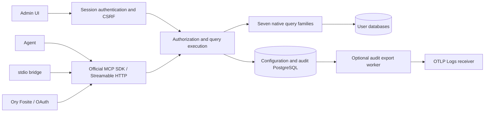

# Architecture

[简体中文](architecture.zh-CN.md)

A single Go process embeds the React application. Configuration and audit records live in the service's own PostgreSQL database. User databases are accessed through administrator-configured accounts; agents never receive connection credentials.

## Code organization

| Path | Responsibility |
|---|---|
| `cmd/mcpdbhub` | serve command and stdio-to-HTTP bridge |
| `internal/server` | Admin HTTP API, setup, login, CSRF and UI routing |
| `internal/mcpserver` | Fourteen MCP tools and JSON Schema validation |
| `internal/engine` | Per-call authorization, connection lifecycle, concurrency, timeouts, cancellation, cursor protection and auditing |
| `internal/semantic` | Catalog definitions, typed value binding and executable definition fingerprints |
| `internal/adapter` | SQL, MongoDB, Redis, Search, Cypher, CQL and InfluxDB |
| `internal/auditexport` | Bounded OTLP Logs encoding, HTTP/gRPC delivery, encrypted configuration and durable progress |
| `internal/oauth` | Fosite provider, persistence, consent, registration, refresh and revocation |
| `internal/store`, `internal/secure` | Configuration transactions, encryption and hashing |
| `web`, `internal/ui` | React/TypeScript source and Go-embedded build output |

## MCP contract

`list_data_sources` takes no arguments and returns only enabled sources authorized for the caller. Each source includes capabilities, examples, limits and verified versions. Every other tool requires `source_id`.

| Tool | Inputs |
|---|---|
| `list_namespaces` | source_id |
| `list_objects` | source_id, optional namespace |
| `describe_object` | source_id, object, optional namespace |
| `query_sql` | query, params or named_params |
| `query_mongodb` | object, operation: find/aggregate/count/distinct; filter, projection, sort, pipeline; the distinct field goes in query |
| `query_redis` | command, args as a string array |
| `query_search` | object/index, operation: search/get/count, body; query contains the document ID for get |
| `query_cypher` | query, named_params |
| `query_cql` | query, params, cursor |
| `query_influxdb` | language: sql/influxql/flux, query, named_params |
| `search_semantics` | source_id, optional keyword, kind, limit, cursor |
| `get_semantic_entry` | source_id, entry_id |
| `execute_query_template` | source_id, template_id, execution_version, parameters, optional cursor and tighter limits |

Queries can tighten `max_rows`, `timeout_seconds` and `max_bytes`; native pagination uses `cursor`. Undeclared connection fields are rejected by the schema. Administrator previews, HTTP MCP and stdio share the execution layer.

Results appear in both `structuredContent` and JSON text. `data` preserves rows, documents, nodes/relationships/paths and time-series tags/columns. `columns` carries available driver-native types. Integers and decimals use strings to avoid JavaScript precision loss; MongoDB uses Canonical Extended JSON; binary values use Base64 and timestamps retain engine precision. Ordinary JSON numeric values are not first converted to float64.

Cypher parameters recursively retain native integer, decimal, list and map types; integers outside int64 are rejected. CQL encodes Decimal, float/double and collections according to prepared-statement parameter types, avoiding premature float conversion of exact decimals. SQL exact decimals can also be supplied as decimal strings with explicit type binding.

Defaults are 30 seconds, 1,000 rows and 5 MiB per request. Administrators can configure up to 120 seconds, 10,000 rows, 20 MiB and 16 concurrent queries per source. Global concurrency is 32; each Agent is limited to four. Queue time counts toward the timeout. Authorization is rechecked after execution, and audit failures prevent returning query results.

AES-GCM cursors bind identity, source revision, original query/parameters/limits and expire after five minutes. MongoDB keeps at most 64 native cursors per source, closes them at expiration, and consumes continuation handles once; a restart invalidates them. CQL uses PageState, Redis uses SCAN cursors and Search uses search_after. SQL and Cypher queries are not implicitly rewritten for pagination. Byte truncation never issues a continuation that could skip rows.

## Read-only implementation and limits

- PostgreSQL-family statements use the PostgreSQL AST; MySQL-family statements use the TiDB parser AST; ClickHouse uses a separate parser. The complete tree is checked for writing CTEs, INTO, locks and related operations. Lexical validation rejects multiple statements and dangerous syntax before execution.
- SQLite's authorizer rejects non-read actions at preparation/execution; files open with mode=ro/query_only. DuckDB checks StatementType=SELECT after preparation, disables external access and automatic extension installation/loading, and locks its configuration.
- PostgreSQL/MySQL/MariaDB/CockroachDB create a new read-only transaction for each query. PostgreSQL/TimescaleDB also set a transaction-local timeout and fixed search_path. TiDB conservatively checks SHOW GRANTS, accepting only SELECT/SHOW VIEW/USAGE and refusing connections without sufficient evidence.
- ClickHouse connections set readonly=1, allow_ddl=0 and execution/result limits. Remote/file table functions and custom functions are rejected.
- CQL restricts the complete token stream to one SELECT and then lets the engine parse it. It does not provide a full CQL AST; a SELECT-only database role is an additional boundary.
- Cypher executes EXPLAIN after complete token checks and runs only statements the engine classifies as read-only. A read session does not prove the account lacks write privileges.
- Function allowlists contain built-in read-only functions. Custom functions, procedure calls and external access are outside the supported subset. Parsing cannot establish the safety of arbitrary extensions or account privileges; configure least-privilege accounts.
- MongoDB recursively rejects `$out/$merge/$where/$function/$accumulator/$eval` and exposes no RunCommand. Aggregation cannot spill to disk.
- Redis/Valkey expose an explicit read-command allowlist and reject EVAL, FUNCTION, MODULE, CONFIG, writing commands, KEYS and blocking commands. Range reads have bounded return sizes.
- Search constructs only fixed read paths and rejects arbitrary paths, scripts, remote indexes and stateful scroll/PIT.
- Flux rejects import/package/option, network parameters, interpolation and non-allowlisted calls. Parameters bind through an extern literal AST compatible with OSS 2.x, without string concatenation. InfluxDB 3 Core uses fixed query APIs; its administrator token is not described as a database read-only credential.

## Administration and OAuth

`/api/sources`, `/api/agents`, `/api/audit`, `/api/catalog` and `/api/settings` serve the five administration pages. `/api/setup` consumes a one-time setup code; `/api/login` creates a 12-hour session. Write endpoints check `X-CSRF-Token`, Host and Origin. Tokens are accepted only in the Authorization header. Remote public URLs require HTTPS.

Agent tokens are stored as SHA-256 hashes; administrator passwords use Argon2id. Database credentials and OAuth records use AES-256-GCM with contextual AAD. The master key is stored separately from the configuration database. Auditing retains identity, source, operation, a keyed query fingerprint, duration, count and error category for 30 days.

[Ory Fosite](https://github.com/ory/fosite) provides authorization codes, PKCE S256, resource audiences, administrator source selection, 15-minute access tokens, 30-day refresh grants, rotation and replay revocation. Each consent creates source grants that can be revoked or narrowed on the Agents page. Token, revocation and consent handlers serialize critical state transitions; PostgreSQL persists state across restarts.

Public metadata is available at `/.well-known/oauth-protected-resource` (including the `/mcp` suffix) and `/.well-known/oauth-authorization-server`. Clients can be pre-registered in the UI or dynamically registered at `/oauth/register`. CIMD uses a public HTTPS document whose URL must equal client_id. Registration is capped at 1,000 clients. Metadata fetches have a 64 KiB limit and five-second timeout, reject redirects, validate every resolved IP as public, and connect directly to that validated address to prevent DNS rebinding. Redirects match exactly, without wildcards.

The implementation follows the [MCP authorization specification](https://modelcontextprotocol.io/specification/2026-07-28/basic/authorization) and [official Go SDK](https://github.com/modelcontextprotocol/go-sdk). External identity providers, multi-tenancy and team RBAC are outside scope.

## Audit export

The optional worker reads committed audit rows and saves encrypted configuration, cursor and delivery status in one PostgreSQL KV record. It does not add network work to query execution. Administrator-only `/api/settings/audit-export` and `/api/settings/audit-export/test` endpoints share the existing session and CSRF boundary. Settings revisions prevent stale credential/configuration updates; changes cancel active export requests. See [OTLP configuration and delivery semantics](audit-export.md).

## Semantic publication

Per-source encrypted draft and published entries are updated in one PostgreSQL transaction with optimistic draft revisions. Templates bind only declared JSON Pointer value slots and reuse the execution engine. Trial and publication proofs bind the executable definition and connection/credentials/observed database version. Queries recheck current authorization and template version before execution and return. Templates-only mode is enforced here for every Agent transport. See the [semantic guide](semantics.md) for workflow, metadata import boundaries, limits and examples.

## Shared ontologies

Encrypted ontology drafts and immutable published versions live independently from source semantic snapshots. Each source snapshot pins one version and stores its own mappings; a transactional reference index protects versions from deletion. The engine builds the source-authorized concept projection only after authorization and captures ontology context at template request start. Definitions and mappings never compile queries or change native results. See [ontology storage, APIs and visibility boundaries](ontologies.md).
