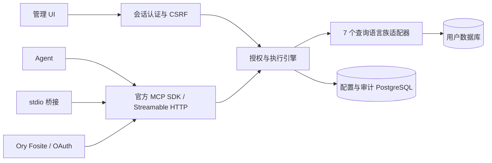

# 接口与执行边界 / Architecture

[English](architecture.md)

单进程 Go 服务内嵌 React 静态资源。配置和审计保存在服务自己的 PostgreSQL 中。用户数据库由管理员配置的账号访问；Agent 不获得连接凭证。

## 目录

| 路径 | 职责 |
|---|---|
| `cmd/mcpdbhub` | serve 命令、stdio → HTTP 桥接 |
| `internal/server` | 管理 HTTP API、初始化、登录、CSRF、UI 路由 |
| `internal/mcpserver` | 14 个 MCP 工具及 JSON Schema 验证 |
| `internal/engine` | 每次调用授权、连接生命周期、并发、超时、取消、游标封装、审计 |
| `internal/adapter` | SQL、MongoDB、Redis、Search、Cypher、CQL、InfluxDB |
| `internal/oauth` | Fosite provider、持久化、同意、注册、刷新和撤销 |
| `internal/store`、`internal/secure` | 配置事务、加密、散列 |
| `web`、`internal/ui` | React/TS 源码、Go 内嵌构建产物 |

## MCP 契约

`list_data_sources` 无参数，只返回当前身份被授权且启用的数据源。每个数据源提供 capability、示例、上限和已验收版本。其余工具均要求 `source_id`。

| 工具 | 输入 |
|---|---|
| `list_namespaces` | source_id |
| `list_objects` | source_id、namespace（可选） |
| `describe_object` | source_id、object、namespace（可选） |
| `query_sql` | query、params 或 named_params |
| `query_mongodb` | object、operation: find/aggregate/count/distinct；filter、projection、sort、pipeline；distinct 字段放 query |
| `query_redis` | command、args 字符串数组 |
| `query_search` | object/index、operation: search/get/count、body；get 的 query 为文档 ID |
| `query_cypher` | query、named_params |
| `query_cql` | query、params、cursor |
| `query_influxdb` | language: sql/influxql/flux、query、named_params |

所有查询可收紧 `max_rows`、`timeout_seconds`、`max_bytes`；原生分页提供 `cursor`。不接受 schema 未声明的连接字段。管理查询、HTTP MCP 与 stdio 使用同一执行层。

结果同时放在 `structuredContent` 与 JSON 文本中。`data` 保留表行、文档、节点/关系/路径、时序标签/列信息。`columns` 提供驱动可得的原生类型。整数/Decimal 使用字符串避免 JavaScript 精度丢失；MongoDB 使用 Canonical Extended JSON；二进制采用 Base64，时间保留引擎提供的精度。JSON 对象的普通数字不会被先转成 float64。

Cypher 参数递归保留整数、小数、列表及 map 的原生类型，超出 int64 的整数拒绝。CQL 根据预备语句参数类型编码 Decimal、float/double 与集合，避免把精确 Decimal 提前转成浮点数。SQL 的精确 Decimal 仍可通过十进制字符串与显式类型绑定传入。

默认每次 30 秒、1,000 条、5 MiB。最大可配置 120 秒、10,000 条、20 MiB、每源 16 并发。全局并发 32、每 Agent 4。等待并发槽也计入超时。完成后再检查授权，审计失败时不返回查询结果。

游标由 AES-GCM 封装并绑定身份、数据源 revision、原始查询/参数/限制，5 分钟过期。MongoDB 原生游标每源最多 64 个、一次消费、到期关闭；服务重启后失效。CQL 使用 PageState，Redis 使用 SCAN 游标，Search 使用 search_after。SQL 和 Cypher 不做隐式重写分页。字节截断时不发放可能漏行的续页游标。

## 只读实现与限制

- PostgreSQL 系使用 PostgreSQL AST；MySQL 系使用 TiDB parser AST；ClickHouse 使用独立 parser。整个语句树检查写入 CTE、INTO、锁等。所有族均先词法扫描，拒绝多语句和危险语法。
- SQLite authorizer 在引擎准备/执行时拒绝非读取动作；文件以 mode=ro/query_only 打开。DuckDB 准备语句后检查 StatementType=SELECT，禁用外部访问、扩展自动安装/加载并锁定配置。
- PostgreSQL/MySQL/MariaDB/CockroachDB 每次执行创建新的只读事务；PostgreSQL/TimescaleDB 设置事务内超时和固定 search_path。TiDB 对 SHOW GRANTS 做保守检查，仅接受 SELECT/SHOW VIEW/USAGE，无法证明时拒绝连接。
- ClickHouse 连接设置 readonly=1、allow_ddl=0、执行/结果上限。禁止远程/文件表函数与自定义函数。
- CQL 对完整 token 流限制为单条 SELECT，再交给引擎解析；不提供完整 CQL AST，数据库 SELECT-only 角色是额外边界。
- Cypher 在完整 token 检查后执行 EXPLAIN，只有引擎分类为只读才执行；读取会话不等同账号本身没有写权限。
- 函数白名单按内置纯读取函数维护；自定义函数、过程调用、外部访问不在支持范围。语法解析不能证明任意数据库扩展或账号权限安全，因此建议始终配置最小权限账号。
- MongoDB 递归拒绝 `$out/$merge/$where/$function/$accumulator/$eval`，不暴露 RunCommand。聚合不允许磁盘溢出。
- Redis/Valkey 只开放显式读取命令，拒绝 EVAL、FUNCTION、MODULE、CONFIG、写命令、KEYS 与阻塞命令。范围读取被限制为有限返回量。
- Search 仅构造固定读取路径，禁止任意路径、脚本、远程索引与有状态 scroll/PIT。
- Flux 禁止 import/package/option、网络参数、插值和非白名单调用。参数用 extern 的字面量 AST 绑定，兼容 OSS 2.x；不拼接字符串。InfluxDB 3 Core 仅调用固定查询 API，不声称管理员 Token 是数据库只读凭证。

## 管理与 OAuth

管理 API 的 `/api/sources`、`/api/agents`、`/api/audit`、`/api/catalog`、`/api/settings` 分别服务五个页面。`/api/setup` 消费一次性设置码；`/api/login` 建立 12 小时会话；写接口检查 `X-CSRF-Token`、Host 与 Origin。Token 只可放在 Authorization Header。远程公开地址必须使用 HTTPS。

Agent Token 只保存 SHA-256；管理员密码为 Argon2id。数据库凭证和 OAuth 记录分别用带上下文 AAD 的 AES-256-GCM 加密。主密钥与配置数据库分开保存。审计只存身份、数据源、操作、带密钥查询指纹、耗时、数量和错误分类，保留 30 天。

OAuth 使用 [Ory Fosite](https://github.com/ory/fosite)，实现授权码、PKCE S256、resource audience、管理员选择数据源、15 分钟 access token、30 天 refresh grant、刷新轮换和重放撤销。每次同意生成可在 Agent 页面撤销/缩小的数据源授权。token/revoke/consent 处理串行化关键状态变更，所有状态保存在 PostgreSQL，重启恢复。

公开元数据：`/.well-known/oauth-protected-resource`（也提供 `/mcp` 后缀）、`/.well-known/oauth-authorization-server`。预注册：管理页面；动态注册：`/oauth/register`；CIMD：公开 HTTPS 文档，client_id 必须等于文档 URL。最多 1,000 客户端。文档最多 64 KiB、5 秒、不跟随重定向，DNS 解析后的地址全部通过公网检查，并直接拨号该解析地址防止重绑定。回调使用精确匹配，无通配符。

实现以 [MCP 授权规范](https://modelcontextprotocol.io/specification/2026-07-28/basic/authorization) 和 [官方 Go SDK](https://github.com/modelcontextprotocol/go-sdk) 为基础；不包含外部 IdP、多租户或团队 RBAC。

## OTLP 审计上报

可选的 `internal/auditexport` 工作协程读取已提交审计，将配置、确认游标和发送状态加密保存在同一 PostgreSQL KV 记录中，不在查询请求中执行网络上报。管理接口 `/api/settings/audit-export` 和 `/api/settings/audit-export/test` 复用管理员会话及 CSRF 校验；版本号阻止旧配置覆盖，变更取消正在发送的请求。详见[配置及发送语义](audit-export.zh-CN.md)。

## 语义发布

每个数据源独立保存加密草稿与发布条目，PostgreSQL 事务与草稿修订控制原子发布和编辑冲突。模板仅绑定声明的 JSON Pointer 值位置，并复用现有执行引擎。试跑及发布证据绑定执行定义、连接、凭证和实际数据库版本；执行前与返回前检查授权和模板版本。仅模板模式在共享引擎中约束所有 Agent 入口。详细流程、结构导入边界、限制及示例见[语义目录说明](semantics.zh-CN.md)。

## 共享本体

本体草稿及不可变发布版本独立加密保存；各源语义快照固定一个版本并独立保存映射。事务内引用索引保护已引用版本。执行层先授权再生成可见概念子集，并在模板请求开始时固定本体上下文，不编译查询或转换原生结果。详见[本体指南](ontologies.zh-CN.md)。
