# Retail ontology example

[简体中文](README.zh-CN.md)

A complete, fictional example for the current **0.4.0** build: four entity types, twenty properties, three relationships, four PostgreSQL object mappings and three executable templates. You can import the ontology alone to explore the graph; a database is needed only for the mapped queries.

```mermaid
erDiagram
    Customer ||--o{ Order : places
    Order ||--|{ OrderLine : contains
    Product ||--o{ OrderLine : "is referenced by"
    Customer {
        integer customer_id PK
        string display_name
        string segment
    }
    Order {
        integer order_id PK
        datetime placed_at
        decimal gross_amount
        string status
    }
    OrderLine {
        integer order_id PK
        integer line_number PK
        integer quantity
        decimal unit_price
    }
    Product {
        integer product_id PK
        string sku
        string name
    }
```



The JSON defines the last relationship in its reading direction: **Order line → refers to → Product**. One product may be referenced by many lines; each line references exactly one product.

## Explore the graph

1. Open **Ontologies → Import JSON** on the ontology list. Paste the complete contents of [ontology.json](ontology.json), including its `id` and `definition` envelope.
2. Open **Model → Graph**. Select Customer, Order, Order line or Product and use **Details** to inspect properties and relationships.
3. Inspect Order line's identity: **Order ID + Line number**. Line number alone is not unique. Money uses decimal types, units and nonnegative ranges. Status, segment and category have enums; date-time fields describe UTC conventions.
4. Click **Validate**, then **Publish version** to make a version available for source binding.

Import into a new ontology to retain the stable ID `retail-example`. Importing into an existing ontology keeps that destination's ID. If the ID already exists, review that ontology rather than overwriting it. When adopting a different destination ID/version, update the semantic binding accordingly.

The definitions are declarative. They do not prove that all stored rows obey the constraints, generate joins, infer facts or convert query results into entities. The fixture supplies its own SQL constraints, but PostgreSQL does not automatically enforce that every order has a line or that its total equals the sum of its lines.

## Run the mapped example

1. As the fixture owner, run [fixture.sql](fixture.sql) against an isolated PostgreSQL database:

   ```sh
   psql "$DEMO_DATABASE_URL" -v ON_ERROR_STOP=1 -f examples/ontologies/retail-demo/fixture.sql
   ```

   This creates `retail_example` with 3 customers, 3 products, 3 orders and 4 order lines. An existing schema causes an error; the script does not replace data.

2. Create a dedicated reader using an administrator's interactive `psql` session. Choose a password with `\password`, keeping it out of scripts:

   ```sql
   CREATE ROLE retail_example_reader LOGIN;
   ALTER ROLE retail_example_reader SET default_transaction_read_only = on;
   GRANT USAGE ON SCHEMA retail_example TO retail_example_reader;
   GRANT SELECT ON ALL TABLES IN SCHEMA retail_example TO retail_example_reader;
   ```

   ```text
   \password retail_example_reader
   ```

3. Configure a PostgreSQL data source with that reader. Test its connection and inspect its read-only evidence. Use **Templates only** to demonstrate a restricted Agent entry point. Configure TLS for your deployment.
4. In its **Semantics**, import [postgres-semantics.json](postgres-semantics.json). The default binding is `retail-example`, version `1`; choose the actual destination version if it differs.
5. In **Ontology mapping**, run the structure check. All 20 mapped property references are discoverable in this fixture.
6. Run **Run all template checks**, then publish the semantic catalog. Each template runs its example plus two regression cases; all nine executions must pass.
7. Grant an Agent this demonstration source, discover the ontology through `search_semantics`, and call `execute_query_template`. An Agent granted only this source cannot discover other source bindings.

## Questions and expected answers

| Business question | Template / parameters | Expected result |
|---|---|---|
| Which orders did customer 1 place? | `customer-orders`, `{"customer_id":1}` | Order 1001: paid, USD 70.00; order 1002: pending, USD 18.00 |
| What products are in order 1001? | `order-lines`, `{"order_id":1001}` | 2 notebooks × USD 12.50 and 1 lamp × USD 45.00 |
| What was September's paid-order amount by customer? | `paid-order-amount`, `{"start_at":"2026-09-01T00:00:00Z","end_at":"2026-10-01T00:00:00Z"}` | Customer 1: USD 70.00; customer 2: USD 90.00; total USD 160.00 |
| Does registered customer 3 have orders? | `customer-orders`, `{"customer_id":3}` | An empty result |

The September metric uses **order placement time** and **current paid status**, with an inclusive start and exclusive end. It excludes the USD 18.00 pending order. It is not cash flow, profit or recognized accounting revenue; taxes, shipping, discounts, refunds and currency conversion are outside this example. Product 103 is inactive but remains available in its historical order line.

Query templates explicitly return money as exact decimal text. Other native types keep the ContextGate's normal lossless encoding. The result includes `ontology_context` with the published ontology version and associated concepts.

The [verification record](verification.json) contains actual OrbStack/API/MCP checks and fictional example results, with no credentials. Native Chrome verified JSON import, definition validation, publication, the four-entity graph, composite identity and relationship details on the main local instance. The main instance contains the definition; database mappings and MCP execution were validated in the separate demo instance. This example changes no server implementation and does not require a full database-matrix rerun.
