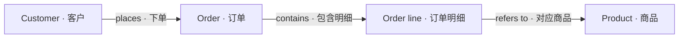

# 零售业务本体示例

[English](README.md)

适用于**0.4.0 及更新版本**。示例包含 **4 个实体、20 个属性、3 条关系、4 张表的映射和 3 个查询模板**，所有业务数据均为虚构数据。

| 实体 | 值得查看的定义 |
|---|---|
| Customer | 客户编号作为身份键；客户可以尚未下单；名称不要求唯一 |
| Order | 每笔订单属于一个客户，包含至少一条明细；金额为 USD，小数精度保留 |
| Order line | 身份键由「订单编号 + 行号」组成；行号不是全局唯一；保存成交数量和单价 |
| Product | 独立商品编号、SKU、分类、在售状态；下架商品仍可被历史订单引用 |

## 先看图，不需要连接数据库

1. 打开 **本体 → 导入 JSON**，粘贴 [ontology.json](ontology.json) 的全部内容，保留最外层 `id` 和 `definition`。
2. 进入 **模型 → 图模式**，点击实体的 **详情**，查看属性和关系；关系线也可点击编辑。
3. 重点查看订单明细的组合身份键、金额的单位与范围、状态枚举和 UTC 时间口径。
4. 点击 **校验 → 发布版本**。发布后才可被数据源映射采用。

列表页导入新本体会保留稳定 ID `retail-example`。在已有本体中导入会保留目标本体自己的 ID。若 ID 已存在，先查看已有内容；不要覆盖自己的定义。映射文件需要采用目标实例真实的本体 ID 和发布版本。

## 再体验真实查询

1. 使用独立 PostgreSQL 演示数据库，由管理员执行 [fixture.sql](fixture.sql)。它创建 `retail_example` schema，包含 3 个客户、3 件商品、3 笔订单和 4 条订单明细；schema 已存在时直接报错，不会替换数据。
2. 按 [英文说明中的 SQL](README.md#run-the-mapped-example) 建立仅有该 schema 读取权限的独立账号，然后在产品中配置 PostgreSQL 数据源。实际密码不要写入示例文件。
3. 在数据源的 **语义 → 导入 JSON** 中导入 [postgres-semantics.json](postgres-semantics.json)，检查其本体绑定，默认是 `retail-example` 的版本 `1`。
4. 在 **本体映射** 中运行结构检查，再运行 **全部模板检查**，通过后发布语义。
5. 可把数据源设为 **仅模板**，并授权给演示 Agent。Agent 通过业务概念发现模板，再执行原生查询。

| 可以问的问题 | 实际预期结果 |
|---|---|
| 客户 1 有哪些订单？ | 1001：已支付，70.00 美元；1002：待支付，18.00 美元 |
| 订单 1001 买了什么？ | 2 本笔记本，单价 12.50 美元；1 盏台灯，单价 45.00 美元 |
| 2026 年 9 月按客户汇总的已支付订单金额是多少？ | 客户 1 为 70.00 美元，客户 2 为 90.00 美元，合计 160.00 美元 |
| 客户 3 有订单吗？ | 返回空结果 |

三个模板分别是 `customer-orders`、`order-lines`、`paid-order-amount`，各包含一次示例试跑和两组回归用例，共 **9 次真实查询检查**。

金额指标按 **UTC 下单时间** 筛选，起点包含、终点不包含，使用订单的**当前状态**；待支付的 18.00 美元不计入。它不等于现金流、利润或会计收入，本例也不包含税费、运费、折扣、退款和换汇。金额由查询显式返回精确小数字符串，其余结果保留原生无损编码，并附带 `ontology_context`。

本体中的身份、必填和基数是声明性约束；本体校验不会逐行检查业务数据，也不会自动生成 JOIN 或推理事实。示例 SQL 单独提供部分约束，但不会自动校验「每个订单至少有一行」和「订单金额等于明细之和」。

[实际验证记录](verification.json)包含 OrbStack 数据库、管理 API 和 MCP 验证结果，不包含凭证。已通过本机 Chrome 验证 JSON 导入、校验、发布、四实体图、组合身份键和关系详情。主实例 19843 已创建并发布本体定义；数据库映射、模板和 MCP 调用在独立演示实例 19844 中验证。
